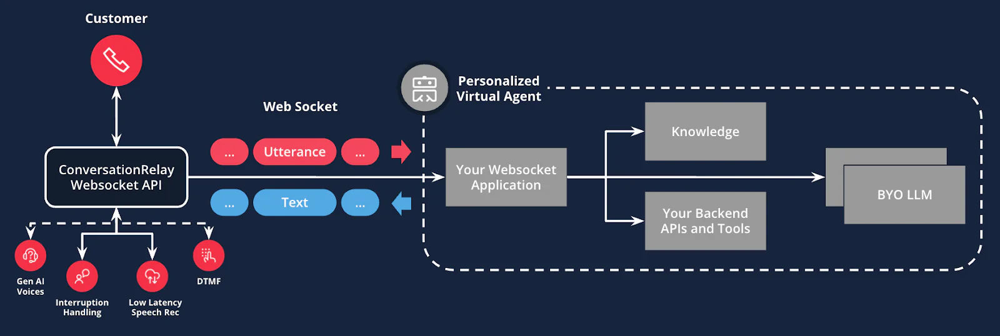

# Voice AI Agent - powered by Twilio ConversationRelay + Twilio Pay

## Disclaimer
This software is to be considered "sample code", a Type B Deliverable, and is delivered "as-is" to the user. Twilio bears no responsibility to support the use or implementation of this software.

## Overview

The **Voice AI Agent** includes a robust **AI-assisted pay** feature that enables seamless payment processing. The AI Assistant guides users through the payment process step-by-step, ensuring a user friendly experience.


### An Example Flow

The payment flow involves the AI agent guiding the user through a secure and seamless payment process. The caller enters credit card information using the phone keypad (DTMF). Below is an example conversation flow:

1. **Account Verification**  
  - The assistant greets the user and requests account verification details:  
    `"Thank you for calling our payment processing line. I'm your automated assistant, here to help you process your payment today. To get started, I'll need to verify your account. Could you please provide your first name, last name, and date of birth?"`  
    - [User provides information]  
    - `"Thank you. I'm verifying your information now... Great, I've confirmed your identity. According to our records, your current balance is two hundred dollars. Does that amount sound correct to you?"`  
    - [User confirms]

2. **Payment Preference**  
  - The assistant asks for the user's payment preference:  
    `"Would you like to proceed with making a payment for the full amount of two hundred dollars today, or would you prefer to make a partial payment?"`  
    - [User indicates preference]

3. **Initiate Payment Session**  
  - The assistant initiates the secure payment system:  
    `"I'll now help you process a payment for two hundred dollars. I'm initiating our secure payment system..."`  
    - [Initiate payment session by calling `start_payment`]  
    - Status callback confirms the session initiation.

4. **Capture Card Number**  
  - The assistant requests the user's card number:  
    `"Please enter your card number."`  
    - [User enters card number]  
    - [Initiate card number capture by calling `capture_payment_card_number`]  
    - Status callback confirms the card number capture 

5. **Capture Expiration Date**  
  - The assistant requests the card's expiration date:  
    `"Please enter your card's expiration date."`  
    - [User enters expiration date]  
    - [Initiate expiration date capture by calling `capture_expiration_date`]  
    - Status callback confirms the expiration date capture.

6. **Capture Security Code**  
  - The assistant requests the card's security code:  
    `"Please enter your card's security code."`  
    - [User enters security code]  
    - [Initiate security code capture by calling `capture_security_code`]  
    - Status callback confirms the security code capture.

7. **Process Payment**  
  - The assistant processes the payment:  
    `"Thank you for providing your payment details. I'm processing your payment now..."`  
    - [Initiate payment processing by calling `complete_payment_processing`]  
    - Status callback confirms the payment processing.

8. **Payment Confirmation**  
  - The assistant confirms the payment:  
    `"Your payment has been successfully processed. You should receive a confirmation shortly. Is there anything else I can help you with today?"`  
    - [User responds]


## Features

- REST API endpoint for incoming calls: The application provides a REST API endpoint (`POST /api/incoming-call`) to process incoming calls. This endpoint initiates the Twilio ConversationRelay to enable seamless communication between the caller and the AI Assistant.

- WebSocket real-time communication: The app leverages WebSocket for real-time communication, ensuring low-latency interactions between the AI Assistant and the caller. This is implemented in the `websocketService` module.

- AI-assisted pay: The application includes a feature that allows the AI Assistant to assist callers in completing payments. This ensures a seamless and secure payment process, leveraging the AI's capabilities to guide users through the transaction.

- Uses OpenAI model and ChatCompletion API in `LLMService`: The application integrates OpenAI's language model through the ChatCompletion API to power the AI Assistant's conversational capabilities. It supports both streaming and non-streaming responses, providing flexibility for different use cases.

- Jest for unit testing: The project includes a comprehensive suite of unit tests written with Jest, ensuring code reliability and robustness during development and deployment.

## Prerequisites for Pay Processing

- Create a [Stripe Account](https://docs.stripe.com/get-started/account)

- Create and configure Twilio [Stripe Pay connector](https://www.twilio.com/docs/voice/twiml/pay/pay-connectors#install-and-configure-a-pay-connector): The Twilio Stripe Pay connector enables secure payment processing by integrating Twilio's Pay API with Stripe, allowing the application to handle credit card transactions.


## Setup

### Open ngrok tunnel

When developing & testing locally, you'll need to open an ngrok tunnel that forwards requests to your local development server.
This ngrok tunnel is used for the Twilio ConversationRelay to send and receive data from a websocket.

To spin up an ngrok tunnel, open a Terminal and run:

```
ngrok http 3000
```

Once the tunnel has been initiated, copy the `Forwarding` URL. It will look something like: `https://[your-ngrok-domain].ngrok.app`. You will
need this when configuring environment variables for the middleware in the next section.

Note that the `ngrok` command above forwards to a development server running on port `3000`, which is the default port configured in this application. If you override the `PORT` environment variable covered in the next section, you will need to update the `ngrok` command accordingly.

1. Clone this repository

2. Navigate to the project directory:
   ```sh
   cd twilio-pay-ai-agent
   ```
3. Install dependencies:
   ```sh
   npm install
   ```
4. Copy the sample environment file and configure the environment variables:
   ```sh
   cp .env.sample .env
   ```

### Environment Variables

Below is the list of required environment variables for the application. Configure these variables in your `.env` file before running the application:

| Variable Name           | Description                                                                                     | Example Value                          |
|-------------------------|-------------------------------------------------------------------------------------------------|----------------------------------------|
| `TWILIO_ACCOUNT_SID`    | Your Twilio Account SID, which can be found in the Twilio Console.                              | `ACXXXXXXXXXXXXXXXXXXXXXXXXXXXXXXXX`   |
| `TWILIO_API_KEY`        | Your Twilio API Key, which can be generated in the Twilio Console.                              | `SKXXXXXXXXXXXXXXXXXXXXXXXXXXXXXXXX`   |
| `TWILIO_API_SECRET`     | Your Twilio API Secret, which is paired with the API Key.                                       | `your_api_secret_here`                 |
| `TWILIO_PAY_CONNECTOR`  | The unique name of your Twilio Pay Connector (e.g., Stripe Connector).                          | `stripe_connector`                     |
| `TWILIO_WORKFLOW_SID`   | The TaskRouter Workflow SID for human assistance.                                               | `WWXXXXXXXXXXXXXXXXXXXXXXXXXXXXXXXX`   |
| `NGROK_DOMAIN`          | The forwarding URL of your ngrok tunnel initiated above.                                        | `[your-ngrok-domain].ngrok.app`        |
| `TRANSFER_PHONE_NUMBER` | The phone number to transfer the call for human assistance.                                     | `+15555555555`                         |
| `WELCOME_GREETING`      | The message automatically played to the caller.                                                 | `Thanks for calling .... How can I help you today?` |
| `OPENAI_API_KEY`        | Your OpenAI API Key for accessing the OpenAI language model.                                    | `sk-XXXXXXXXXXXXXXXXXXXXXXXXXXXXXXXX`  |

5. In the Twilio Console, go to Phone Numbers > Manage > Active Numbers and select an existing phone number (or Buy a number). In your Phone Number configuration settings, update the first A call comes in dropdown to Webhook and set the URL to https://[your-ngrok-domain].ngrok.app/api/incoming-call, ensure HTTP is set to HTTP POST, and click Save configuration.

### Run the app

Once dependencies are installed, `.env` is set up, and Twilio is configured properly, run the dev server with the following command:

```
npm run dev
```

### Testing the app

With the development server running, you can now begin testing the Voice AI Assistant. Place a call to the configured phone number and start interacting with your AI Assistant.

When prompted for your first name, last name, and date of birth, use one of the users from the mock data (e.g., John Doe with DOB, May 1st 1990).

```typescript
// Example user from mock data
{
  firstName: "John",
  lastName: "Doe",
  dob: "1990-05-01",
}
```

## Scripts

- `npm run dev`: Start the development server
- `npm run build`: Compile TypeScript
- `npm start`: Run the production build
- `npm test`: Run unit tests

## API Endpoints

- `POST /api/incoming-call`: Process incoming call - Initiates ConversationRelay (see [src/routes/callRoutes.ts](src/routes/callRoutes.ts))
- `POST /api/status-callback`: Handles status callbacks from Twilio during the payment process. This endpoint processes updates such as payment session initiation, card number capture, expiration date capture, security code capture, and payment completion. (see [src/routes/statusCallbackRoutes.ts](src/routes/statusCallbackRoutes.ts))
- `POST /api/action`: Handle connect action - Human agent handoff (see [src/routes/connectActionRoutes.ts](src/routes/connectActionRoutes.ts))

## WebSocket

- Real-time communication setup (see [src/services/llm/websocketService.ts](src/services/llm/websocketService.ts))

## Configuration

- Environment variables are loaded from the `.env` file (see [src/config.ts](src/config.ts))

## LLM Services

- `LLMService`: Manages interactions with the language model (see [src/services/llm/llmService.ts](src/services/llm/llmService.ts))

### Tools

- `verifyUserIdentity`: Verifies user identity (see src/services/llm/tools/verifyUserIdentity.ts)
- `checkPendingBill`: Checks for pending medical bills (see src/services/llm/tools/checkPendingBill.ts)
- `checkPaymentOptions`: Provides payment options available to the user (see src/services/llm/tools/checkPaymentOptions.ts)
- `startPaySession`: Starts a payment session (see src/services/llm/tools/startPaySession.ts)
- `capturePaymentCardNumber`: Captures the payment card number from the user (see src/services/llm/tools/capturePaymentCardNumber.ts)
- `captureExpirationDate`: Captures the expiration date of the payment card (see src/services/llm/tools/captureExpirationDate.ts)
- `captureSecurityCode`: Captures the security code of the payment card (see src/services/llm/tools/captureSecurityCode.ts)
- `completePaymentSession`: Completes the payment session (see src/services/llm/tools/completePaymentSession.ts)
- `cancelPaymentSession`: Cancels the payment session (see src/services/llm/tools/cancelPaymentSession.ts)
- `humanAgentHandoff`: Transfers the call to a human agent (see src/services/llm/tools/humanAgentHandoff.ts)
- `switchLanguage`: Switches the language for the session (see src/services/llm/tools/switchLanguage.ts) 

### Session State

The application maintains session state during the payment process. Key aspects tracked include:

- **Credit Card Details**: Card number, expiration date, and security code.
- **Capture Progress**: Flags indicating completion of card details capture and payment processing.
- **Payment Status**: Tracks the status, errors, and confirmation details of the payment.
- **Session Metadata**: Includes call identifiers, payment connector, charge amount, and currency.

The session state is managed in-memory and resets upon completion or cancellation of the payment process. For scalability, persistent storage can be implemented.


### ConversationRelay Architectural Diagram




### Data

- Mock data (see [src/data/mock-data.ts](src/data/mock-data.ts))

### License

This project is licensed under the MIT License.